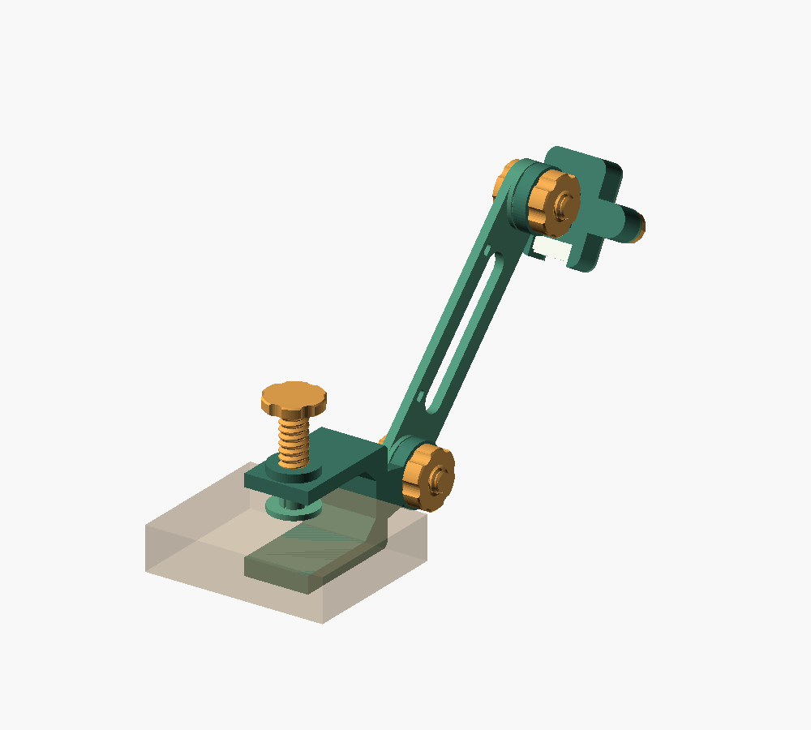

# CamS3 5MP 全印刷クランプアーム

M5Stack Unit CamS3 5MP（U174-B / PY260）を、厚さ20mmの棚板に取り付けるための採用モデルです。アームの軸間距離は120mm。根元とカメラ側の2か所で、15度刻みに上下の角度を変えられます。ボルト、ナット、ノブもすべて印刷するため、金属ねじや接着剤は不要です。左右の首振り機構はありません。

## 現在の設計

カメラの内寸は24.6×40.6×8.4mm、ねじのクリアランスは0.35mmです。カメラとねじの嵌合は印刷済み部品で確認済みです。

| 部位 | 寸法 |
| --- | --- |
| アーム中央 / 関節厚 | 4 / 6mm |
| 関節円盤 | 直径28mm（歯の高さ0.8mmは別） |
| クランプ幅 | 30mm |
| クランプ上あご / 下あご / 背骨 | 6 / 8 / 8mm |
| クランプねじ座 | 直径22mm、ねじがかかる厚み10mm |
| クランプ外側の奥の上下角 | 各辺2mm・45度の面取り（内側の補強は維持） |
| ホルダー側壁 / 前面押さえ枠 | 1.8 / 1.6mm |
| カメラ背面壁 / ケースとの隙間 | 1.6 / 1.6mm |

[クランプの形状を見る](clamp_preview.png) / [カメラ背面の形状を見る](cradle_preview.png)

最新の追加は、中心間60mmのアーム2本で中間関節を設ける選択肢です。今回印刷するのは **`arm_60_base.stl`、`arm_60_camera.stl`、`joint_screw.stl`、`joint_nut.stl` を各1個** です。クランプとホルダー、根元と先端の関節ねじ・ナットは流用します。既存の120mm版 `arm.stl` も残しています。変更後の保持力と抜け止めの嵌合は実物では未確認です。

### 60mmアーム2本の印刷と組み立て

[2本アームの組み立て図](two_arms_preview.png)

両アームとも中心間60mm・全長88mm・幅28mm・最大厚さ6.8mmです。上記4部品を各1個、サポートなしで印刷します。アームの歯は上、ねじはノブを下、ナットは平置きです。

- `arm_60_base.stl`：クランプから中間関節まで。
- `arm_60_camera.stl`：中間関節からカメラホルダーまで。
- `joint_screw.stl` と `joint_nut.stl`：中間関節に追加。

クランプ側アームの歯をクランプの歯へ向けて取り付けます。カメラ側アームは裏返し、**小さな長穴に近い方の丸い端を中間関節**に重ねます。この端は歯を半山ずらしてあるため、端を逆にしないでください。中間関節のねじはクランプ側アームの平らな裏面から通し、カメラ側アームの平らな裏面にナットを付けます。カメラホルダーは残った端へ、歯同士を向かい合わせて取り付けます。

根元・中間・カメラ側の3関節は15度刻みで固定します。緩めて歯を離してから角度を変え、棚板・ホルダー・ノブに当たらない範囲で使います。初回は3関節が締まり、カメラの重さで下がらないか確認してください。可動範囲全体と実物の保持力は未検証です。

`plate_1.stl` と `plate_2.stl` は従来の120mmアーム1本用です。60mm版は上記の個別STLで印刷します。OpenSCADで2本版を見る場合は `part="assembly_two_arms"` を選び、`elbow_angle` で中間関節の表示角度を変えます。

カメラホルダーへの装着はユーザー確認済みです。押さえ枠は外形が揃う現在の `bezel.stl` を使用してください。以前の3mm厚の枠はねじ位置が共通ですが、外形が大きいため縁が揃いません。小ねじ2本は共通です。

## ファイル

SCAD・STL・手順書はすべて `cams3-clamp-arm` ディレクトリ直下に置きます。このフォルダーには現在採用しているモデルだけを残し、ZIP・旧版・試験片は置きません。Bambu StudioでSTLを直接開いてください。

- `cams3-clamp-arm.scad`：寸法と部品を選ぶOpenSCAD正本。
- `printed-fasteners.scad`：印刷用の粗いねじ形状。同じフォルダーに置きます。
- `plate_1.stl`：本体4部品を配置した印刷用プレート。
- `plate_2.stl`：ボルト・ナット・押さえ足8部品のプレート。
- このディレクトリ直下の部品別STL：個別印刷用。必要数は下表を参照してください。
- `mesh-checks.json`：OpenSCAD書き出し後の寸法・閉じた面・独立部品数の確認結果。

`assembly` は完成状態の確認用です。印刷にはプレートまたは部品別STLを使ってください。画像のカメラと棚板は参考表示で、印刷部品には含まれません。色は部品を見分けるためのもので、AMS liteなし・単色で印刷できます。

配置図：[本体プレート](plate_1.png) / [ねじ・押さえ足プレート](plate_2.png)

## 印刷部品

| STL名 | 部品 | 数 |
| --- | --- | ---: |
| `clamp.stl` | 棚板用Cクランプ（ねじ穴一体） | 1 |
| `arm.stl` | 軸間120mmのアーム | 1 |
| `cradle.stl` | カメラ受けと角度調整関節 | 1 |
| `bezel.stl` | カメラ前面の押さえ枠 | 1 |
| `foot.stl` | 直径22mm・高さ8mm、4分割の抜け止め付き押さえ足 | 1 |
| `clamp_screw.stl` | 外径12mm・ピッチ3mm・ねじ部36mm＋抜け止め先端6mmのノブ付きねじ | 1 |
| `joint_screw.stl` | 外径10mm・ピッチ2.5mm・軸長24mmの関節ねじ | 2 |
| `joint_nut.stl` | 関節用の手締めナット | 2 |
| `bezel_screw.stl` | 外径6mm・ピッチ1.5mm・軸長11mmの押さえ枠ねじ | 2 |

合計12部品です。ねじは独自の樹脂用形状で、市販のM6/M10/M12ねじとは互換性がありません。ねじ山は実際のらせん形状です。

## Bambu Lab A1 miniでの印刷

A1 miniの造形範囲は180×180×180mmです（[Bambu Lab公式仕様](https://jp.store.bambulab.com/en/products/a1-mini)）。標準モデルは2枚のプレートに配置済みです。最大の単体部品はアームの148×28×6.8mmで、各STLは印刷時の向き・底面Z=0で出力しています。

プレート外形の実測値は `mesh-checks.json` を参照してください。各部品と標準プレートの180mm以内への収まりを確認して配布します。

最初の設定案は、0.4mmノズル、積層0.20mm、PETG、壁5周、上下6層、ジャイロイド40%です。ねじ部品は小さいため、100%充填でも構いません。温度とベッド温度は使用フィラメントのA1 mini用プロファイルに従ってください。PLAでも嵌合試作はできますが、常設用はPETGを初期候補としています。これらは実機で検証済みの印刷プロファイルではありません。

1. 部品別STLをBambu Studioで直接開き、必要な部品だけ印刷します。60mmアーム2本版は上記4部品を追加印刷します。新しいSTLは関節の平らな裏面をベッドに置き、歯を上にした向きです。抜け止め付きねじと足が未印刷の場合は、それぞれ1個をサポートなしで印刷します。足の切れ目と穴にはサポートを入れません。抜け止めの初回確認はPETGを想定し、PLAでは爪の割れやすさも確認してください。
2. 残りの部品は「印刷部品」の表の必要数を印刷します。`plate_1.stl` と `plate_2.stl` は全部品をまとめた配置なので、個別STLと両方を印刷する必要はありません。既存部品を流用する場合は重複分を除いてください。
3. プレートSTLを使う場合は、Bambu Studioで読み込み、**オブジェクトに分割**します。クランプとホルダーだけサポートを設定します。再配置する場合も付属の印刷方向を維持してください。
4. `clamp` は側面を下にした姿勢です。関節円盤と首はベッドに接地するため、その下のサポートは不要です。ねじ座の張り出した下面にはツリーサポートを設定します。`cradle` はカメラ側を下にした姿勢で、内側の背面天井と関節下面にサポートが必要です。内側のサポートはカメラを入れる開口から除去します。ねじ穴・関節歯・カメラ外周が接触する段差にはサポートを塗らないようにします。
5. アームは歯を上、ボルトはノブを下、ナットは平置き、押さえ足は広い接触面を下にします。これらと押さえ枠はサポートなしが基本です。

プレートSTL自体にはサポート設定・フィラメント・速度などは保存されていません。サポートやブリムがプレート外へ出る場合は部品を別のプレートへ移してください。

## 組み立て

1. 先に大きなクランプねじを上側のねじ穴へ通し、先端を下向きに内側へ出します。その後、押さえ足を平面に置き、ねじ先端を穴へまっすぐ押してはめ込みます。4分割の爪が先端の出っ張りを保持し、緩めても足が落ちにくく、軸回りには回転できる設計です。強く押しても入らない、爪が白くなる・割れる場合は無理に押さず、嵌合の調整が必要です。組み付け後は手で回転と抜け止めを確認します。繰り返し着脱する用途は想定していません。ねじ穴の中心は壁の内面から34mmです。
2. 棚板を差し込み、下側のあごと上からの押さえ足で挟みます。内側の角には補強があるため、板端は背面の壁まで完全には入りません。ノブを手で軽く締め、足の平らな面全体を板に当てます。
3. アームの歯がある面を、クランプ関節の歯へ向けます。歯のないアーム裏面から関節ねじを通し、反対側からナットを付けます。
4. アーム先端にも同じ向きでカメラ受けを接続します。関節を緩めて歯を一度離し、15度刻みで角度を選び、かみ合わせて締めます。歯を締めたまま無理に回さないでください。
5. カメラを受けに入れ、レンズを外向き、Grove/microSDのある短辺を切り欠き側に合わせます。押さえ枠を載せ、小さいねじ2本で固定します。枠が受けに接触したところで止めます。
6. Groveケーブルを接続します。関節を動かしても端子を引っ張らない余裕を残し、必要に応じてアームの穴を配線整理に使います。印刷モデルにケーブルや結束部品は含みません。

手締め用の試作設計です。工具で増し締めせず、実機で保持状態を確認してください。カメラとねじの嵌合は印刷済み部品で確認済みですが、薄型本体の実機検証、樹脂ねじの寿命、長期間の保持力は未確認です。

## 寸法の変更

OpenSCADのカスタマイザー、またはファイル先頭で変更します。

| パラメーター | 初期値 | 内容 |
| --- | ---: | --- |
| `shelf_thickness` | 20 | 板厚。18〜22mmの範囲でクランプ開口を変更 |
| `arm_length` | 120 | 関節の軸間距離。80〜140mm |
| `camera_clearance` | 0.3 | ケース外周の片側の隙間。0.2〜0.6mm |
| `thread_clearance` | 0.35 | 雌ねじの半径方向の隙間。0.2〜0.5mm |
| `arm_angle` | 45 | 組立表示のアーム角度。15度刻み |
| `camera_angle` | -30 | 組立表示のカメラ角度。15度刻み |
| `part` | `assembly` | 組立表示・プレート・個別部品の選択 |

`thread_clearance=0.35` は直径差0.70mmです。調整は0.05mmずつを目安にします。ケース厚8mmに対して奥行きは8.4mmあり、レンズ突起を押し付けません。

寸法変更後、OpenSCADで部品を選んでF6レンダリングし、STLを書き出します。一括更新はこのフォルダーで `python3 export.py` を実行します。Python標準ライブラリとOpenSCAD 2021.01以降を使用します。`arm_angle` と `camera_angle` は組立表示だけを変え、部品STLには影響しません。可動端では棚やケーブルへの干渉を実物で確認してください。

## 寸法の根拠と検証範囲

[M5Stack公式仕様](https://docs.m5stack.com/en/unit/Unit-CAMS3%205MP)と[公式寸法図](https://static-cdn.m5stack.com/resource/docs/products/unit/Unit-CAMS3%205MP/img-92a0b5bb-a0c6-4604-8e2b-ca7856313280.jpg)の外形40×24mm、ケース厚8mm、レンズ込み11mm、角R3を参照しています。[公式構造STL](https://github.com/m5stack/M5_Hardware/tree/master/Products/U174%E2%80%91B_Unit_CamS3%E2%80%915MP/Structures)も参照し、端子がある短辺を開放し、背面の壁とケースの間に隙間を残しました。製品図の2.54mmと17.78mmは電気ピンの寸法であり、固定穴として使用していません。公式モデルはこの配布物には含めず、プレビューのカメラは簡略形状です。

OpenSCADでSTLを書き出し、閉じた面、面の向き、独立部品数、180mm以内の外形、底面位置を確認します。これらはデータの検証であり、実際の印刷・嵌合・耐荷重試験を代替するものではありません。
